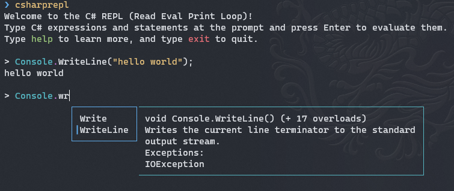
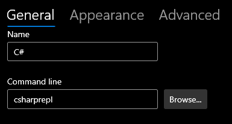
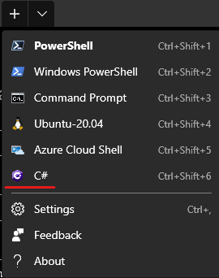

{"title": "C# REPL in Windows Terminal", "date": "2021-06-19"}

In this blogpost I will show you how to set up a C# REPL in Windows Terminal.

## What is a C# REPL?

REPL stands for Read/Evaluate/Print loop. The user types in a command, the command gets evaluated, and the output is returned to the user. A C# REPL uses C# as the command language.

This is different from the traditional way of using C#. Traditionally the user would write a C# program, compile it, and run it. A REPL is interactive, you get instant feedback.

## Many C# REPLs

There are quite a few C# REPLs out there. 

* [C# interactive](https://www.youtube.com/watch?v=2xilWlL7X5A) : This is a windows in Visual Studio.
* csi.exe : this is the engine behind C# interactive. It can be run in a terminal but it's Windows only.
* [dotnet-script](https://github.com/filipw/dotnet-script) : This allows you to run .csx files but it also contains a REPL. It does not have intellisense or syntax highlighting.

In this blogpost, I want to focus on [CSharpRepl](https://github.com/waf/CSharpRepl) : it's a cross platform (.Net 5) C# REPL that supports syntax highlighting and intellisense.

## CSharpRepl

CSharpRepl is installed as a global tool :

```
dotnet tool install -g csharprepl
```

Once installed all you have to do to invoke it is type `csharrepl` and you're good to go:



## Integrating with Windows Terminal

In Windows Terminal, click CTRL+, to bring up the settings tab. Click "Add new", name it C# and type in `csharprepl` as the command line option:



And you're good to go.




Hope this helps.